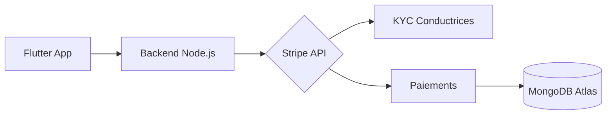
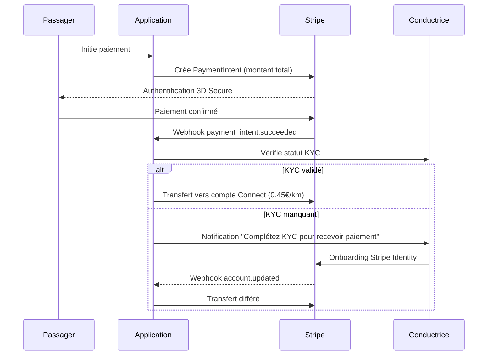
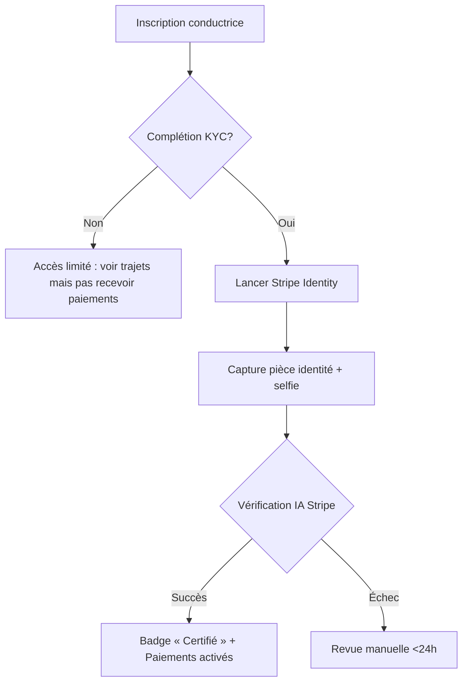
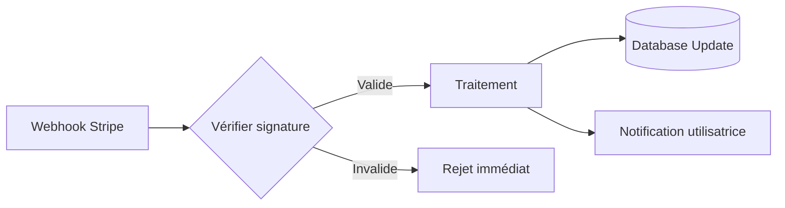
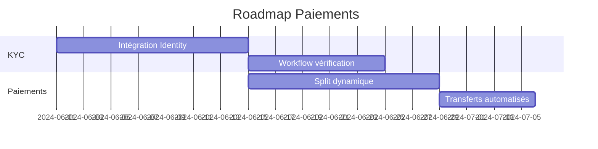

Voici la documentation technique adaptée intégrant la gestion KYC et la stratégie de paiement en deux parties :

---

## 📋 **Documentation technique : Gestion des paiements Entrelles**

### 🎯 **Architecture globale**


---

## 🔥 **1. Types de paiements & flux KYC**

### **A. Abonnement (3€/mois)**
```javascript
// Création de l'abonnement
await stripe.subscriptions.create({
  customer: user.stripeId,
  items: [{ price: 'price_1RYa3b4GtFeoWSgT7uK1TC0I' }],
});
```

### **B. Paiement trajet avec KYC intégré**


---

## ⚡ **2. Workflow KYC pour conductrices**

### **Processus d'onboarding**


**Messages clés :**
- Avant KYC : "✅ Recevez vos paiements 2x plus vite en complétant votre vérification !"
- Après KYC : "🚀 Félicitations ! Votre profil certifié attire 40% plus de réservations"

---

## 🔧 **3. Modifications techniques**

### **Backend (Node.js/Express)**
```javascript
// Nouveau modèle User
const userSchema = new Schema({
  stripeId: String,
  kycStatus: { 
    type: String, 
    enum: ['pending', 'verified', 'rejected', 'incomplete'] 
  },
  stripeConnectId: String, // Pour conductrices vérifiées
  lastPayoutDate: Date
});

// Handler webhook account.updated
router.post('/webhook', async (req, res) => {
  if (req.body.type === 'account.updated') {
    const account = req.body.data.object;
    await User.updateOne(
      { stripeConnectId: account.id },
      { kycStatus: account.requirements.disabled_reason ? 'incomplete' : 'verified' }
    );
  }
});
```

### **Frontend Flutter**
```dart
// Écran de progression KYC
KyCProgressBar(
  steps: const [
    KyCStep("Identité", completed: true),
    KyCStep("Selfie", completed: true),
    KyCStep("Domicile", completed: false),
  ],
  onComplete: _enableDriverPayouts,
)
```

---

## 📊 **4. Événements Stripe étendus**

### **Nouveaux événements critiques**
```javascript
// Suivi KYC
✅ account.updated
✅ identity.verification_session.created
✅ identity.verification_session.verified

// Transferts conductrices
✅ transfer.created
✅ transfer.paid
✅ transfer.failed
```

### **Workflow de sécurité**


---

## 🚀 **Plan d'implémentation révisé**

### **Phase 1 : Abonnements + KYC Foundation**
1. Intégration Stripe Identity SDK
2. Workflow d'onboarding conductrices
3. Stockage statut KYC dans MongoDB

### **Phase 2 : Paiements trajets avec KYC intégré**


### **Phase 3 : Optimisation**
1. Système de retry pour transferts échoués
2. Dashboard conductrice avec suivi paiements
3. Alertes KYC expirant (tous les 24 mois)

---

## 💡 **Bonnes pratiques recommandées**

1. **Limites sans KYC :**
   - Max 3 trajets sans vérification
   - Paiements bloqués après 30 jours
   
2. **Incentives :**
   ```javascript
   // Après complétion KYC
   await stripe.payouts.create({
     amount: 500, // 5€ bonus
     currency: 'eur',
     destination: driver.stripeConnectId
   });
   ```

3. **Monitoring :**
   ```bash
   # Logs critiques à tracker
   "KYC_FAILED"
   "TRANSFER_RETRY"
   "PAYOUT_DELAYED"
   ```

Cette documentation intègre la gestion KYC comme composant central tout en maintenant l'architecture technique existante. La séparation paiement trajet/commission est maintenue via les transferts Stripe Connect après vérification KYC.